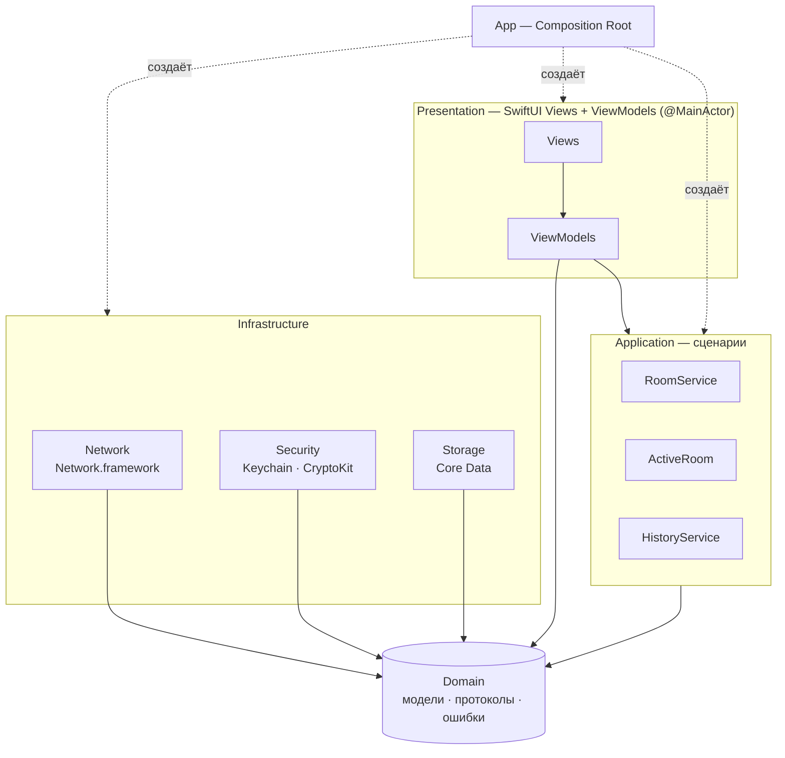
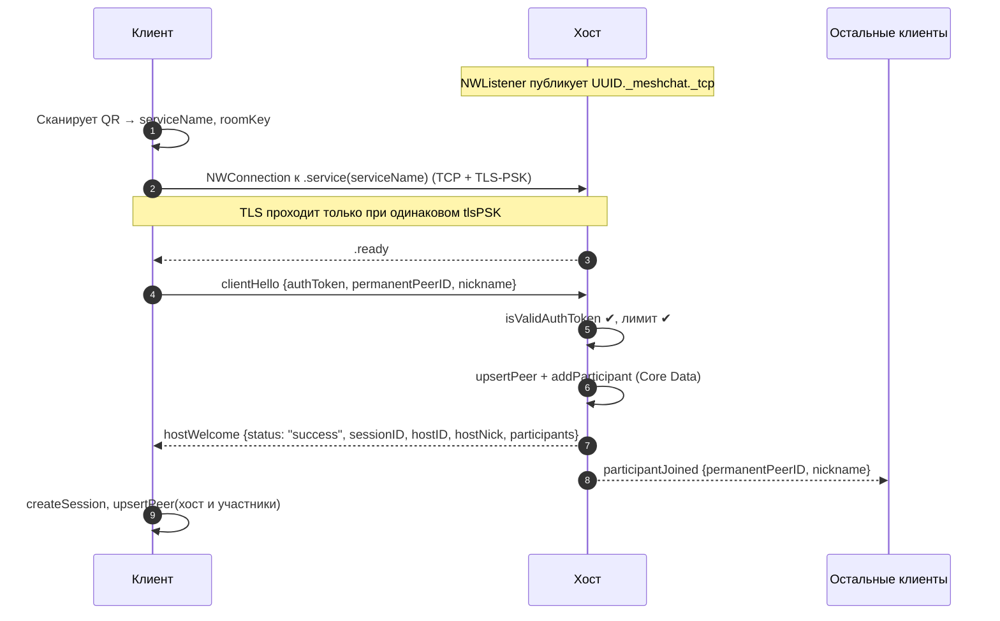
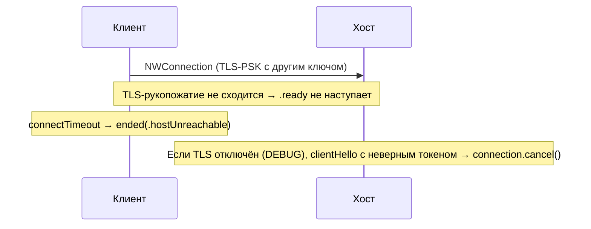
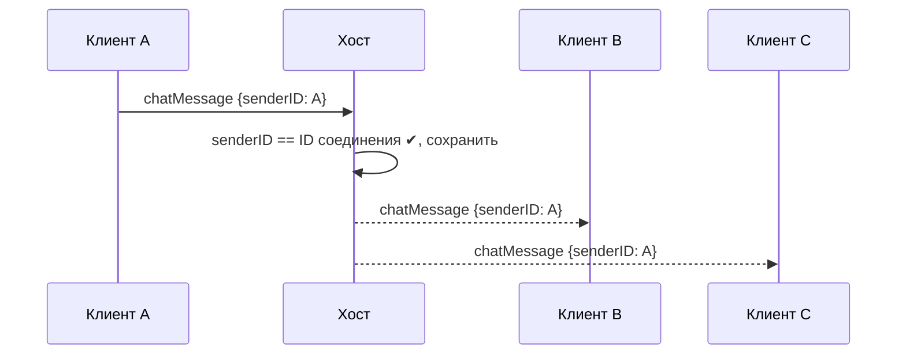
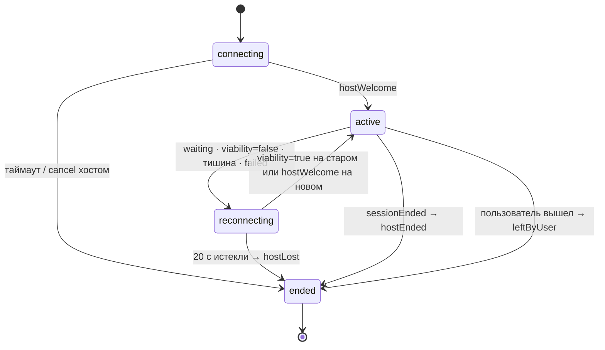
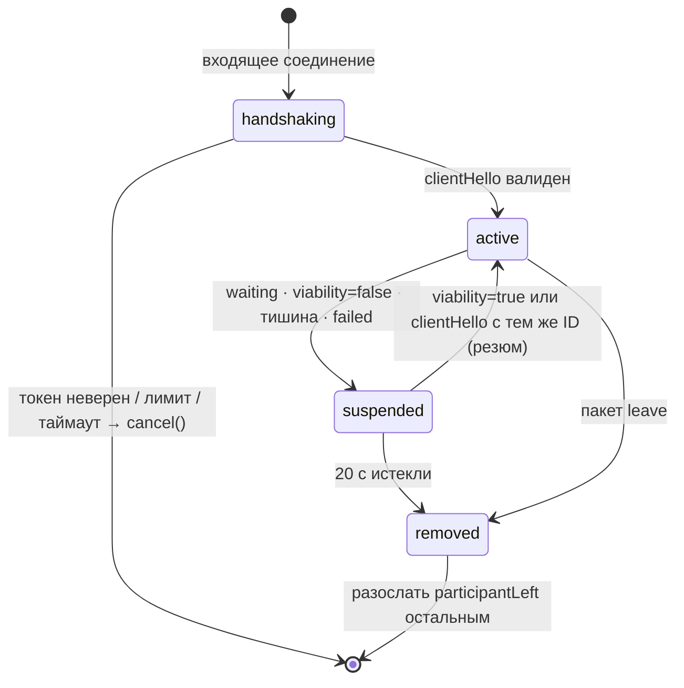
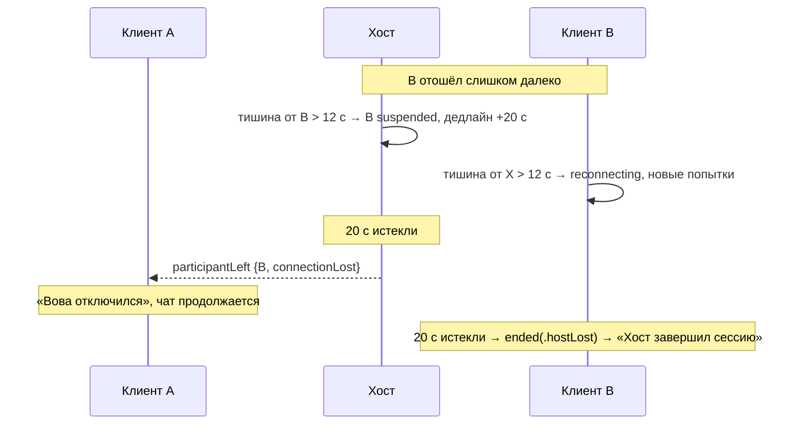
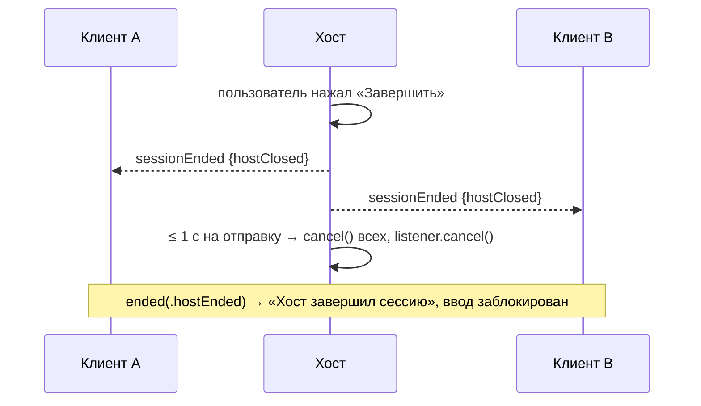
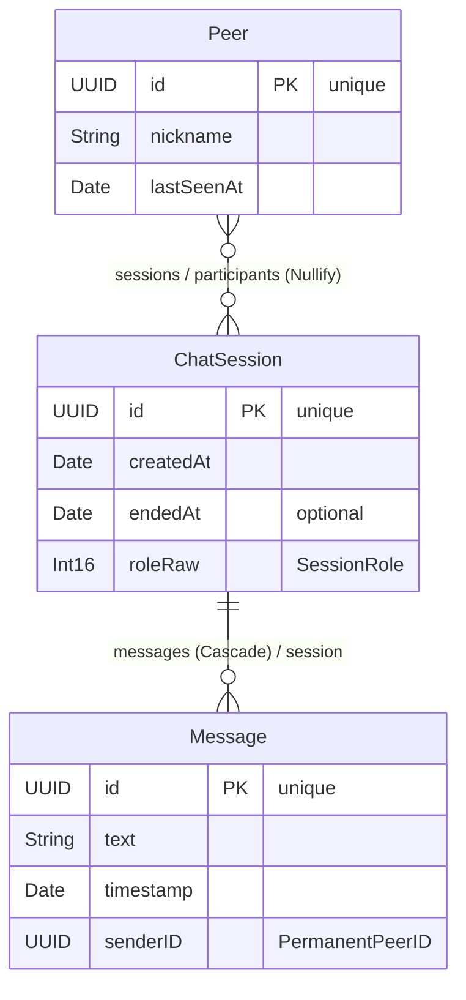

# MeshChat — архитектура проекта

> **Статус:** v1.0 (утверждено) · **Лицензия:** GPL-3.0-or-later · **Платформа:** iOS 17.0+, Swift 6, SwiftUI, Core Data, Network.framework
>
> Этот документ — **источник истины**. Любой код, промпт ИИ-агенту и коммит сверяется с ним.
> Архитектура меняется только правкой этого файла отдельным коммитом `docs(architecture): …`.

## Содержание

1. [Обзор](#1-обзор)
2. [Сверка требований и архитектурные решения (ADR)](#2-сверка-требований-и-архитектурные-решения-adr)
3. [Слои и правило зависимостей](#3-слои-и-правило-зависимостей)
4. [Структура папок](#4-структура-папок)
5. [Domain: модели и события](#5-domain-модели-и-события)
6. [Security: крипто-паспорт и ключ комнаты](#6-security-крипто-паспорт-и-ключ-комнаты)
7. [Network Layer](#7-network-layer)
8. [Протокол обмена (wire protocol)](#8-протокол-обмена-wire-protocol)
9. [Разрывы связи, реконнект и таймауты](#9-разрывы-связи-реконнект-и-таймауты)
10. [Storage Layer (Core Data)](#10-storage-layer-core-data)
11. [Application Layer: сценарии](#11-application-layer-сценарии)
12. [Presentation: SwiftUI + ViewModel](#12-presentation-swiftui--viewmodel)
13. [Composition Root и внедрение зависимостей](#13-composition-root-и-внедрение-зависимостей)
14. [Ошибки и логирование](#14-ошибки-и-логирование)
15. [Модель угроз и известные ограничения](#15-модель-угроз-и-известные-ограничения)
16. [Стратегия тестирования](#16-стратегия-тестирования)
17. [Конвенции кода и Git](#17-конвенции-кода-и-git)
18. [Дорожная карта](#18-дорожная-карта)

---

## 1. Обзор

**MeshChat** — офлайн-мессенджер для небольшой группы людей, находящихся рядом. Не нужны ни интернет, ни серверы, ни аккаунты. Один телефон создаёт комнату (**хост**), остальные (**клиенты**, до 4) входят, отсканировав QR-код с экрана хоста.

### 1.1. Цели v1

- Групповой текстовый чат до 5 участников (1 хост + 4 клиента) без интернета.
- Автоматический выбор канала связи силами Network.framework.
- Анонимность в эфире: снаружи не видно ни постоянного ID, ни никнейма.
- Постоянная локальная история: переписка с одним и тем же человеком связывается между сессиями по его `PermanentPeerID`.
- Предсказуемое поведение при разрывах: 20-секундное окно на восстановление.
- Чистый, модульный, покрытый тестами код, пригодный для open source.

### 1.2. Не-цели v1 (осознанно не делаем)

- Работа в фоне (iOS приостанавливает фоновые приложения — см. ADR-11).
- Файлы, фото, голосовые сообщения.
- Настоящая многоузловая mesh-маршрутизация (multi-hop).
- Сквозное шифрование между клиентами (хост — ретранслятор и видит сообщения).
- Синхронизация истории между устройствами, облако, Android.
- Подтверждения доставки и прочтения.

### 1.3. Глоссарий

| Термин | Значение |
|---|---|
| **Хост** | Устройство, создавшее комнату. Запускает `NWListener`, авторизует клиентов, ретранслирует сообщения. |
| **Клиент** | Устройство, вошедшее в комнату по QR. Держит одно `NWConnection` — к хосту. |
| **Сессия (комната)** | Один сеанс чата от создания хостом до завершения. Имеет `sessionID` (UUID). |
| **PermanentPeerID** | Постоянный UUID устройства. Генерируется один раз, хранится в Keychain, в открытом эфире не передаётся. |
| **Никнейм** | Имя, которое пользователь ввёл локально. Передаётся только участникам комнаты внутри зашифрованного канала. |
| **Service type** | Тип Bonjour-сервиса, константа приложения: `_meshchat._tcp`. |
| **Service name** | Имя экземпляра Bonjour-сервиса. Случайный UUID, новый для каждой комнаты. |
| **Invite** | Содержимое QR-кода: имя сервиса + ключ комнаты. |
| **roomKey** | 256-битный ключ комнаты, выведенный из пароля и случайной соли. Реализация «хэша пароля» из ТЗ. |
| **Пакет** | JSON-сообщение протокола в кадре с длиной-префиксом. |
| **Грейс-период** | 20 секунд, в течение которых разорванная связь может восстановиться без потери участника. |

---

## 2. Сверка требований и архитектурные решения (ADR)

### 2.1. Требования → реализация

| # | Требование ТЗ | Как реализуем | Примечание |
|---|---|---|---|
| R1 | Без Multipeer Connectivity | Только Network.framework | ✅ |
| R2 | `NWListener` / `NWConnection` + async/await | Обёртки-акторы и `AsyncStream` над классическим API | ADR-07 |
| R3 | Автовыбор канала Wi-Fi / Bluetooth | Автовыбор **инфраструктурный Wi-Fi ↔ peer-to-peer Wi-Fi** | ⚠️ Bluetooth фреймворк не использует — ADR-01 |
| R4 | Без интернета | Bonjour в домене `local.` + peer-to-peer Wi-Fi | ✅ |
| R5 | 1 хост + до 4 клиентов | Лимит в `HostSession`, лишние соединения закрываются | ✅ |
| R6 | Случайное Bonjour-имя на каждую комнату | `serviceName = UUID().uuidString` | ✅ Тип сервиса при этом постоянный — см. §15 |
| R7 | `PermanentPeerID` в Keychain, в эфир напрямую не идёт | Keychain + передача только внутри TLS | ⚠️ Хэндшейк содержит ID → нужен шифрованный канал — ADR-03 |
| R8 | Никнейм хранится только локально | `UserDefaults` на устройстве | ✅ |
| R9 | Хост хэширует пароль → QR | `roomKey = HKDF(пароль, соль)` → QR | ADR-04 |
| R10 | Клиент на `.ready` автоматически шлёт `{хэш, ID, ник}` | Пакет `clientHello` с `authToken` | ✅ |
| R11 | Хост проверяет, отвечает `{success, ID, ник}` или `cancel()` | Пакет `hostWelcome` / `connection.cancel()` | ✅ Без ручного одобрения |
| R12 | Core Data: Peer, ChatSession, Message | Схема §10 + связь Peer ↔ ChatSession | ✅ Добавлены минимально нужные поля |
| R13 | Сессия → сообщения: One-to-Many, Cascade | `ChatSession.messages`, delete rule Cascade | ✅ |
| R14 | Fetch-or-create Peer по ID при хэндшейке | `StorageManaging.upsertPeer` + `addParticipant` | ✅ |
| R15 | `.waiting` → таймер 20 с | Грейс-период 20 с с расширенными триггерами | ⚠️ ADR-05 |
| R16 | Потеря хоста → «Хост завершил сессию», отправка заблокирована | `SessionState.ended(.hostLost / .hostEnded)` | ✅ |
| R17 | Потеря клиента → служебный пакет остальным, чат продолжается | Пакет `participantLeft` | ✅ |
| R18 | Conventional Commits, коммит после каждой фичи | Правила §17.4 и `CLAUDE.md` | ✅ |

### 2.2. Архитектурные решения

#### ADR-01. Транспорт: TCP + TLS через Network.framework, `includePeerToPeer = true`

- **Факт, важный для защиты курсовой:** Network.framework **не использует Bluetooth**. Apple отключила peer-to-peer поверх Bluetooth на уровне Bonjour ещё в iOS 11; сейчас «связь без роутера» — это **peer-to-peer Wi-Fi** (внутреннее название технологии — AWDL, но это деталь реализации, а не API).
- При `includePeerToPeer = true` система сама выбирает путь: если оба устройства в одной Wi-Fi-сети — инфраструктурный Wi-Fi, иначе — peer-to-peer Wi-Fi. Интернет не нужен ни в одном из случаев.
- **Требование к пользователю:** Wi-Fi включён (подключаться к какой-либо сети не обязательно). Bluetooth для работы не нужен.
- Формулировка для пояснительной записки: *«Выбор физического канала (инфраструктурный Wi-Fi или peer-to-peer Wi-Fi) выполняется Network.framework автоматически»*.
- Побочный эффект: peer-to-peer Wi-Fi добавляет задержку порядка сотен миллисекунд. Для текстового чата это некритично.
- Настоящий Bluetooth потребовал бы Core Bluetooth (GATT, своя фрагментация, низкая скорость) — отдельный проект, в v1 не входит.

#### ADR-02. Топология «звезда»

Хост — центр: он принимает соединения, авторизует и ретранслирует сообщения. Клиенты друг с другом напрямую не соединяются.
Слово **mesh** в названии означает «сеть из устройств рядом, без инфраструктуры». Для защиты: *«децентрализованный — значит без центрального сервера и интернета: каждая комната — самостоятельная эфемерная сеть, которую поднимает одно из устройств»*.
Почему не полносвязная сеть: при 5 участниках звезда проще, хост — естественная точка авторизации, а число соединений растёт линейно, а не квадратично.

#### ADR-03. Канал шифруется TLS-PSK с ключом из QR

Первый пакет клиента содержит `PermanentPeerID` и никнейм. Без шифрования они шли бы по радио открытым текстом, и требование R7 было бы нарушено. Поэтому:

- соединение использует TLS с **pre-shared key** (PSK), выведенным из `roomKey` (§6.3);
- это стандартный для Network.framework подход (так сделан пример Apple *Building a custom peer-to-peer protocol*);
- клиент с неверным QR не проходит даже TLS-рукопожатие и не доходит до `.ready`;
- прикладная проверка токена в `clientHello` **сохраняется** (защита в глубину + требование R11);
- в DEBUG-сборке доступен режим без TLS для отладки трафика; в Release он вырезан компилятором.

#### ADR-04. «Хэш пароля» = ключ комнаты `roomKey`, в пакет идёт HMAC-токен

- Короткий пароль без соли можно перебрать офлайн по перехваченному TLS-трафику. Поэтому хост генерирует **случайную 32-байтовую соль на каждую комнату**, и `roomKey = HKDF-SHA256(пароль, соль)`.
- QR содержит `roomKey`, а не пароль и не соль. Пароль нигде не сохраняется.
- В `clientHello` отправляется не сам ключ, а `authToken = HMAC-SHA256(roomKey, "meshchat/auth/v1|" + PermanentPeerID)`. Токен привязан к ID клиента и не раскрывает ключ.

#### ADR-05. Реконнект: расширенные триггеры грейс-периода

Поведение `NWConnection`, которое нужно знать:

1. Состояние `.failed` **терминально**: экземпляр соединения больше не оживёт, для повтора нужен **новый** `NWConnection`.
2. `.waiting` типично для этапа **установки** соединения (сети нет — соединение ждёт). После `.ready` потеря пути чаще проявляется через `viabilityUpdateHandler(false)`, тишину в канале или переход в `.failed`.

Поэтому 20-секундный грейс-период из ТЗ запускается **любым** из сигналов: `.waiting`, `viability == false`, отсутствие входящих пакетов дольше `silenceTimeout`, `.failed`. Переподключается всегда **клиент** (он знает Bonjour-имя хоста из QR); хост только ждёт. Подробности — §9.

#### ADR-06. Кадрирование: 4-байтовая длина + JSON

TCP — это поток байт, границ сообщений в нём нет. Каждый пакет передаётся как `[UInt32 big-endian длина][UTF-8 JSON]`. Максимальный размер кадра — 64 КиБ; больше — нарушение протокола, соединение закрывается.

#### ADR-07. Конкурентность: Swift 6, акторы, `AsyncStream`

- Swift 6 language mode, строгая проверка гонок данных компилятором.
- Классические `NWListener` / `NWConnection` (колбэки на `DispatchQueue`) оборачиваются в типы с API на `async/await` и `AsyncStream`.
- Сессии (`HostSession`, `ClientSession`) — **акторы**: всё изменяемое состояние сессии изолировано, гонки невозможны по построению.
- Предпочтение — структурные задачи (`withDiscardingTaskGroup`). Неструктурированный `Task` допустим только для таймеров, с хранением handle и явной отменой.
- **Рассмотрено и отложено:** новый Swift-API Network.framework (`NetworkConnection` / `NetworkListener`, iOS 26+). Отложено, потому что поднимает минимальную версию до iOS 26 и для него нет проверенного примера TLS-PSK. Транспорт спрятан за протоколом `PeerConnection`, поэтому миграция позже затронет только слой Network.

#### ADR-08. Core Data за границей DTO

- Модель — `MeshChat.xcdatamodeld`, Codegen = **Manual/None**, классы сущностей написаны вручную.
- `NSManagedObject` **никогда** не покидает слой Storage: наружу отдаются `Sendable`-структуры из Domain.
- Все записи — через один фоновый контекст (`context.perform`); уникальность ID гарантируется ограничениями модели и алгоритмом fetch-or-create.

#### ADR-09. Внедрение зависимостей через протоколы, без синглтонов и сторонних библиотек

Все менеджеры описаны протоколами в Domain. Конкретные реализации создаются только в Composition Root (§13). Это даёт тестируемость (фейки) и SwiftUI Previews без сети и диска. Сторонних зависимостей нет.

#### ADR-10. Личность устройства

`PermanentPeerID` хранится в Keychain с доступностью `kSecAttrAccessibleAfterFirstUnlockThisDeviceOnly`: не синхронизируется в iCloud и не переносится на другое устройство. Никнейм не секретен и хранится в `UserDefaults`.

#### ADR-11. Только активный режим (foreground)

iOS приостанавливает приложение вскоре после ухода в фон, после чего `NWListener` и соединения перестают работать. Правила v1:

- во время сессии `UIApplication.shared.isIdleTimerDisabled = true` (экран не гаснет);
- уход хоста в фон для клиентов выглядит как потеря связи → у них идёт грейс-период 20 с;
- при возврате в `.active` хост перезапускает listener **с тем же** `serviceName` и `roomKey`, и клиенты успевают переподключиться, если уложились в 20 с.

---

## 3. Слои и правило зависимостей



**Главное правило:** зависимости направлены **к Domain**. Слои общаются только через протоколы из Domain. Конкретные типы знает только Composition Root.

Все слои — папки одного таргета, поэтому «зависимость» здесь означает «обращение к типам»: код слоя может использовать типы Domain и своего слоя, но не конкретные типы других слоёв. Для системных фреймворков правило проверяется по `import`:

| Слой | Может импортировать | Запрещено импортировать |
|---|---|---|
| **Domain** | `Foundation` | `SwiftUI`, `CoreData`, `Network`, `Security`, `CryptoKit` |
| **Security** | `Foundation`, `Security`, `CryptoKit`, Domain | `SwiftUI`, `CoreData`, `Network` |
| **Storage** | `Foundation`, `CoreData`, Domain | `SwiftUI`, `Network` |
| **Network** | `Foundation`, `Network`, `CryptoKit`, `Security` (фреймворк), `os`, Domain | `SwiftUI`, `CoreData` |
| **Application** | `Foundation`, `os`, Domain | `SwiftUI`, `CoreData`, `Network` |
| **Presentation** | `SwiftUI`, `UIKit`, `Observation`, `VisionKit`, `CoreImage`, Domain, Application | `CoreData`, `Network` |
| **App** | всё | — |

> Соблюдение правила можно проверить командой `grep -rn "import CoreData" <App>/ | grep -v "/Storage/"` — вывод должен быть пустым (аналогично для `import Network` вне `/Network/`).

### 3.1. Кто за что отвечает

| Слой | Ответственность | Не отвечает за |
|---|---|---|
| Presentation | Отрисовка, ввод, форматирование, навигация | Сеть, БД, крипто |
| Application | Сценарии: «создать комнату», «войти», «отправить», связывает сеть с хранилищем | Детали протокола и схемы БД |
| Network | Bonjour, соединения, кадры, хэндшейк, ретрансляция, реконнект | Сохранение данных, UI |
| Security | Keychain, `PermanentPeerID`, ключ комнаты, токены | Сеть, БД |
| Storage | Схема Core Data, запросы, fetch-or-create | Сеть, UI |
| Domain | Модели-значения, протоколы менеджеров, ошибки | Любые фреймворки, кроме Foundation |

---

## 4. Структура папок

Проект использует синхронизируемые папки Xcode (Xcode 16+): файлы, созданные на диске внутри папки таргета, автоматически попадают в проект.

```text
MeshChat/                              ← корень репозитория
├── ARCHITECTURE.md                    ← этот документ
├── CLAUDE.md                          ← правила для ИИ-агента
├── README.md
├── LICENSE                            ← полный текст GNU GPL v3
├── .gitignore
├── Config/
│   └── Info.plist                     ← вне синхронизируемой папки (иначе конфликт сборки)
├── MeshChat.xcodeproj
├── MeshChat/                          ← таргет приложения (синхронизируемая папка)
│   ├── App/
│   │   ├── MeshChatApp.swift
│   │   └── AppEnvironment.swift       ← Composition Root
│   ├── Domain/
│   │   ├── Models/                    ← PeerProfile, ChatMessage, ChatSessionInfo, SessionRole, RoomInvite…
│   │   ├── Events/                    ← SessionState, SessionEvent, RoomEvent…
│   │   ├── Protocols/                 ← StorageManaging, IdentityProviding, MeshNetworking…
│   │   └── Errors/
│   ├── Security/
│   │   ├── KeychainStore.swift
│   │   ├── IdentityProvider.swift
│   │   └── RoomCredentials.swift
│   ├── Network/
│   │   ├── Configuration/             ← NetworkConfiguration, NWParameters+MeshChat
│   │   ├── Protocol/                  ← Packet, PacketCodec, FrameAssembler
│   │   ├── Transport/                 ← NWPeerConnection, BonjourHostListener, BonjourClientConnector
│   │   ├── Session/                   ← HostSession, ClientSession, Heartbeat, ReconnectPolicy
│   │   └── MeshNetworkService.swift
│   ├── Storage/
│   │   ├── MeshChat.xcdatamodeld
│   │   ├── PersistenceController.swift
│   │   ├── Entities/                  ← PeerEntity, ChatSessionEntity, MessageEntity
│   │   ├── Mapping/                   ← Entity → Domain
│   │   └── CoreDataStorageManager.swift
│   ├── Application/
│   │   ├── RoomService.swift
│   │   ├── ActiveRoom.swift
│   │   └── HistoryService.swift
│   ├── Presentation/
│   │   ├── Root/  Onboarding/  Home/  HostRoom/  JoinRoom/  Chat/  History/
│   │   └── Shared/                    ← QRCodeImage, компоненты, форматтеры
│   └── Resources/                     ← Assets.xcassets, Localizable.xcstrings
└── MeshChatTests/                     ← Swift Testing; структура зеркалит таргет
    ├── Storage/  Network/  Security/  Application/
    └── Fakes/                         ← FakePeerConnection, InMemoryStorage…
```

---

## 5. Domain: модели и события

Все типы Domain — `Sendable`-значения без зависимостей, кроме Foundation.
Доменные модели **не** `Codable`: формат пакетов описан отдельными DTO в слое Network (§8.6), чтобы изменение протокола не задевало домен и базу. Исключение — `RoomInvite`: его JSON и есть формат QR (§6.4).

```swift
/// Участник, известный приложению. `id` — это PermanentPeerID.
struct PeerProfile: Sendable, Hashable, Identifiable {
    let id: UUID
    var nickname: String
}

/// Текстовое сообщение чата.
struct ChatMessage: Sendable, Hashable, Identifiable {
    let id: UUID
    let text: String
    let timestamp: Date
    /// PermanentPeerID отправителя (своего или чужого).
    let senderID: UUID
}

/// Роль локального устройства в сессии. Raw value хранится в Core Data.
enum SessionRole: Int16, Sendable {
    case host = 0
    case client = 1
}

/// Сессия чата в том виде, в котором её видит приложение.
struct ChatSessionInfo: Sendable, Hashable, Identifiable {
    let id: UUID
    let createdAt: Date
    var endedAt: Date?
    let role: SessionRole
    var participants: [PeerProfile]
}

/// Локальная личность пользователя.
struct LocalIdentity: Sendable, Hashable {
    let peerID: UUID
    let nickname: String
    var profile: PeerProfile { PeerProfile(id: peerID, nickname: nickname) }
}

/// Содержимое QR-кода приглашения. JSON-ключи: "app", "v", "svc", "key" (§6.4).
struct RoomInvite: Sendable, Hashable, Codable {
    static let currentVersion = 1
    let version: Int
    /// Случайное имя Bonjour-сервиса (UUID-строка).
    let serviceName: String
    /// 32 байта ключа комнаты (в JSON — base64, стандартная стратегия JSONEncoder).
    let roomKey: Data
}
```

### 5.1. Состояния и события сессии

```swift
enum SessionState: Sendable, Equatable {
    /// Хост: listener запускается. Клиент: соединение и хэндшейк ещё не завершены.
    case connecting
    /// Чат работает, отправка разрешена.
    case active
    /// Связь потеряна, идёт грейс-период до `deadline`.
    case reconnecting(deadline: Date)
    /// Сессия завершена окончательно.
    case ended(SessionEndReason)
}

enum SessionEndReason: Sendable, Equatable {
    case leftByUser            // пользователь сам вышел / хост сам завершил
    case hostEnded             // клиент получил sessionEnded
    case hostLost              // клиент не восстановил связь за 20 с
    case rejected              // хост закрыл соединение во время хэндшейка
    case hostUnreachable       // за connectTimeout не дошли до .ready: хоста нет рядом или QR чужой (TLS не сошёлся)
    case handshakeTimeout
    case localNetworkDenied    // нет разрешения «Локальная сеть»
    case failed(String)        // прочие ошибки (текст — для логов)
}

enum LeaveReason: String, Sendable {
    case left                  // участник вышел сам
    case connectionLost        // грейс-период истёк
}

/// События сетевого слоя для слоя Application.
enum SessionEvent: Sendable, Equatable {
    case stateChanged(SessionState)
    /// Сессия установлена; для клиента — после hostWelcome. Приходит один раз.
    case established(sessionID: UUID)
    case participantJoined(PeerProfile)
    case participantLeft(PeerProfile, LeaveReason)
    case messageReceived(ChatMessage)
}
```

> `AsyncStream` рассчитан на **одного** потребителя. Каждый поток событий в проекте читает ровно один объект (сессию читает `ActiveRoom`, `ActiveRoom` читает ViewModel).

---

## 6. Security: крипто-паспорт и ключ комнаты

### 6.1. Протоколы

```swift
/// Постоянная личность устройства.
protocol IdentityProviding: Sendable {
    /// Возвращает PermanentPeerID. При первом вызове генерирует UUID и сохраняет в Keychain.
    func permanentPeerID() throws -> UUID
    /// Никнейм или nil, если онбординг ещё не пройден.
    func nickname() -> String?
    /// Сохраняет никнейм (после trim, длина 1…32), иначе бросает IdentityError.invalidNickname.
    func setNickname(_ nickname: String) throws
}

/// Тонкая обёртка над Security.framework (kSecClassGenericPassword).
protocol KeychainStoring: Sendable {
    func read(account: String) throws -> Data?
    func write(_ data: Data, account: String) throws
    func delete(account: String) throws
}
```

### 6.2. Keychain

| Параметр | Значение |
|---|---|
| `kSecClass` | `kSecClassGenericPassword` |
| `kSecAttrService` | `"<bundle id>.identity"` |
| `kSecAttrAccount` | `"permanentPeerID"` |
| `kSecValueData` | 16 байт UUID |
| `kSecAttrAccessible` | `kSecAttrAccessibleAfterFirstUnlockThisDeviceOnly` |

Особенность iOS: элементы Keychain, как правило, переживают удаление приложения, поэтому `PermanentPeerID` остаётся постоянным и после переустановки.

### 6.3. Ключ комнаты и производные ключи

```text
salt       = 32 случайных байта (новые для каждой комнаты, нигде не сохраняются)
roomKey    = HKDF<SHA256>(ikm: UTF8(password), salt: salt, info: "meshchat/room-key/v1", 32 байта)
tlsPSK     = HMAC<SHA256>(key: roomKey, data: "meshchat/tls-psk/v1")
authToken  = HMAC<SHA256>(key: roomKey, data: "meshchat/auth/v1|" + permanentPeerID.uuidString)
```

Протоколы лежат в Domain (без CryptoKit), реализация — в Security. Так Network и Application работают с секретом комнаты, не зная о CryptoKit и конкретных типах.

```swift
// Domain/Protocols
/// Секрет комнаты. Живёт только в памяти, никогда не пишется на диск и в логи.
protocol RoomSecret: Sendable {
    var roomKeyData: Data { get }                          // для QR
    var tlsPreSharedKey: Data { get }                      // для NWProtocolTLS.Options
    func authToken(for peerID: UUID) -> Data
    /// Сравнение за постоянное время.
    func isValidAuthToken(_ token: Data, for peerID: UUID) -> Bool
}

protocol RoomSecretProviding: Sendable {
    /// Хост: новая соль + ключ из пароля.
    func makeSecret(password: String) -> any RoomSecret
    /// Клиент: ключ из приглашения. Бросает ошибку, если ключ не 32 байта.
    func secret(from invite: RoomInvite) throws -> any RoomSecret
}

// Security/RoomCredentials.swift
struct RoomCredentials: RoomSecret { /* SymmetricKey внутри, HKDF и HMAC из CryptoKit */ }
struct RoomCredentialsFactory: RoomSecretProviding { /* SecRandomCopyBytes для соли */ }
```

### 6.4. Формат QR

QR кодирует компактный JSON (генерация — `CIFilter.qrCodeGenerator()`, сканирование — `DataScannerViewController` из VisionKit):

```json
{ "app": "meshchat", "v": 1, "svc": "6B1F2C8E-3D4A-4F5B-9C7D-8E9F0A1B2C3D", "key": "q7Xk2vN9…base64…" }
```

Клиент отклоняет QR, если `app != "meshchat"`, `v` не поддерживается или ключ не равен 32 байтам.

---

## 7. Network Layer

### 7.1. Компоненты

| Компонент | Вид | Ответственность |
|---|---|---|
| `NetworkConfiguration` | `struct` | Тип сервиса, лимиты, все таймауты (§9.4). Внедряется, в тестах — короткие значения. |
| `NWParameters+MeshChat` | `extension` | TCP (keepalive, noDelay) + TLS-PSK + `includePeerToPeer = true`. |
| `Packet` | `enum` | Все типы пакетов протокола (§8). |
| `PacketCodec` | `struct` | `Packet` ↔ JSON ↔ кадр с длиной-префиксом. Чистая функция, 100 % покрытие тестами. |
| `FrameAssembler` | `struct` | Собирает целые кадры из произвольных кусков TCP-потока. Чистая логика, без сети. |
| `NWPeerConnection` | `final class` | Обёртка над `NWConnection`: состояние, viability и входящие пакеты → `AsyncStream`; `send` через `async`. |
| `BonjourHostListener` | `final class` | Обёртка над `NWListener`: публикует сервис, отдаёт поток входящих соединений. |
| `BonjourClientConnector` | `struct` | Создаёт `NWPeerConnection` к `NWEndpoint.service(name:type:domain:interface:)`. |
| `HostSession` | `actor` | Авторизация, лимит участников, ретрансляция, грейс-периоды клиентов. |
| `ClientSession` | `actor` | Автоматический хэндшейк, heartbeat, переподключение к хосту. |
| `MeshNetworkService` | `struct` | Фабрика сессий, реализует `MeshNetworking`. |

Клиенту **не нужен** `NWBrowser`: имя сервиса известно из QR, и `NWConnection` к `.service(...)` сам разрешает Bonjour-имя в адрес.

### 7.2. Публичные протоколы (Domain) — их видит слой Application

```swift
/// Фабрика сетевых сессий.
protocol MeshNetworking: Sendable {
    func makeHostSession(identity: LocalIdentity, secret: any RoomSecret) -> any HostSessionManaging
    func makeClientSession(identity: LocalIdentity, invite: RoomInvite,
                           secret: any RoomSecret) -> any ChatSessionManaging
}

/// Активная сессия чата с точки зрения сети. Реализации — акторы HostSession и ClientSession.
protocol ChatSessionManaging: AnyObject, Sendable {
    var role: SessionRole { get }
    /// Единственный поток событий сессии. Завершается после `.ended`.
    var events: AsyncStream<SessionEvent> { get }
    /// Запускает сессию и сразу возвращается; дальнейший ход — через `events`.
    func start() async
    /// Отправляет текст от имени локального пользователя и возвращает созданное сообщение.
    /// Бросает `NetworkError.notActive`, если состояние не `.active`.
    func send(text: String) async throws -> ChatMessage
    /// Хост: разослать `sessionEnded` и остановиться. Клиент: отправить `leave` и закрыться.
    func end() async
}

protocol HostSessionManaging: ChatSessionManaging {
    var sessionID: UUID { get }
    var invite: RoomInvite { get }
    /// Вызывается при возврате приложения в `.active`: перезапускает listener, если он упал (ADR-11).
    func resumeAfterForeground() async
}
```

### 7.3. Внутренние протоколы (Network) — для подмены фейками в тестах

```swift
enum ChannelSecurity: Sendable {
    case tlsPSK(Data)
    #if DEBUG
    case plaintext          // только для отладки трафика; в Release не существует
    #endif
}

enum ConnectionState: Sendable, Equatable {
    case preparing, ready, waiting(String), failed(String), cancelled
}

enum ConnectionEvent: Sendable {
    case state(ConnectionState)
    case viability(Bool)
    case packet(Packet)
    case protocolViolation(PacketCodecError)   // после него соединение закрывается
}

/// Одна двунаправленная связь с удалённой стороной. Ничего не знает о чате.
protocol PeerConnection: AnyObject, Sendable {
    /// Локальный ID соединения (НЕ PermanentPeerID).
    var connectionID: UUID { get }
    /// События в порядке поступления. Завершается после `.failed` / `.cancelled`.
    var events: AsyncStream<ConnectionEvent> { get }
    func start()
    /// Завершается, когда данные переданы сетевому стеку (`.contentProcessed`).
    func send(_ packet: Packet) async throws
    /// Идемпотентно.
    func cancel()
}

enum ListenerEvent: Sendable {
    case ready
    case failed(String)
    case incoming(any PeerConnection)
}

protocol HostListening: AnyObject, Sendable {
    /// Публикует `<serviceName>.<serviceType>` и отдаёт поток событий listener'а.
    func start(serviceName: String, security: ChannelSecurity) throws -> AsyncStream<ListenerEvent>
    func stop()
}

protocol ClientConnecting: Sendable {
    func makeConnection(serviceName: String, security: ChannelSecurity) -> any PeerConnection
}
```

### 7.4. Параметры соединения (эскиз)

```swift
extension NWParameters {
    static func meshChat(security: ChannelSecurity) -> NWParameters {
        let tcp = NWProtocolTCP.Options()
        tcp.noDelay = true
        tcp.enableKeepalive = true
        tcp.keepaliveIdle = 2

        let parameters: NWParameters
        switch security {
        case .tlsPSK(let psk):
            parameters = NWParameters(tls: .meshChatPSK(psk), tcp: tcp)
        #if DEBUG
        case .plaintext:
            parameters = NWParameters(tls: nil, tcp: tcp)
        #endif
        }
        parameters.includePeerToPeer = true      // разрешить peer-to-peer Wi-Fi
        return parameters
    }
}
// NWProtocolTLS.Options.meshChatPSK(_:) — по образцу Apple sample
// «Building a custom peer-to-peer protocol»: sec_protocol_options_add_pre_shared_key
// + PSK-шифронабор. Реализуется на этапе 9 дорожной карты.
```

- **Хост:** `NWListener(using: .meshChat(...))`, `listener.service = NWListener.Service(name: serviceName, type: "_meshchat._tcp")`.
- **Клиент:** `NWConnection(to: .service(name: invite.serviceName, type: "_meshchat._tcp", domain: "local.", interface: nil), using: .meshChat(...))`.
- Все колбэки `NWConnection`/`NWListener` выполняются на приватной последовательной `DispatchQueue` обёртки и переводятся в `AsyncStream.Continuation.yield`.

### 7.5. Алгоритм хоста

```text
start():
  sessionID = UUID(); serviceName = UUID().uuidString
  listener.start(serviceName, .tlsPSK(secret.tlsPreSharedKey))
  ListenerEvent.ready  → state = .active (хост может писать сразу, даже в пустой комнате)
  ListenerEvent.failed → нет разрешения «Локальная сеть» ? .ended(.localNetworkDenied) : .ended(.failed)

на каждое входящее соединение c (дочерняя задача группы):
  c.start(); ждать .ready                             ─ таймаут handshakeTimeout → c.cancel()
  ждать первый пакет                                  ─ таймаут handshakeTimeout → c.cancel()
  guard пакет == clientHello(h)                       иначе c.cancel()
  guard h.protocolVersion == 1                        иначе c.cancel()
  guard secret.isValidAuthToken(h.authToken, h.id)    иначе c.cancel()   ← «неверный пароль»
  guard h.id != мой PermanentPeerID                   иначе c.cancel()
  если h.id уже есть среди участников (активен или в грейс-периоде):
      резюм: старое соединение → cancel, новое занимает его место, таймер грейс-периода отменяется
  иначе:
      guard активных + ожидающих < maxClients (4)     иначе c.cancel()   ← «комната заполнена»
  отправить hostWelcome(status: "success", sessionID, мой профиль, остальные участники)
  если участник новый:
      emit .participantJoined(profile)                 → Application: upsertPeer + addParticipant
      разослать participantJoined остальным
  цикл приёма пакетов c (§8.4) + контроль тишины (§9)
```

### 7.6. Алгоритм клиента

```text
start():
  state = .connecting
  c = connector.makeConnection(invite.serviceName, .tlsPSK(secret.tlsPreSharedKey)); c.start()
  ждать .ready                                        ─ таймаут connectTimeout → .ended(.hostUnreachable)
      .waiting(PolicyDenied)                          → .ended(.localNetworkDenied)
  АВТОМАТИЧЕСКИ отправить clientHello(authToken, мой ID, ник, resumeSessionID: nil)
  ждать hostWelcome                                   ─ таймаут handshakeTimeout → .ended(.handshakeTimeout)
      соединение закрыто хостом до ответа             → .ended(.rejected)
  emit .established(sessionID)
  emit .participantJoined(хост) и по одному на каждого из welcome.participants
  state = .active
  цикл приёма + heartbeat (§9)
```

### 7.7. Правила ретрансляции (хост)

1. От клиента принимается `chatMessage`, только если `senderID` совпадает с `PermanentPeerID`, авторизованным на **этом** соединении. Иначе — нарушение протокола, соединение закрывается.
2. Принятое сообщение: `emit .messageReceived` (хост сохраняет его у себя) → переслать **всем остальным** активным клиентам. Отправителю эхо не отправляется.
3. Своё сообщение хост рассылает всем активным клиентам.
4. Клиентам в грейс-периоде ничего не отправляется (в v1 без буферизации — §15.2).
5. Порядок сообщений в комнате = порядок их обработки актором хоста.

---

## 8. Протокол обмена (wire protocol)

### 8.1. Кадр

```text
┌────────────────────────┬──────────────────────────────────────┐
│ length: UInt32, BE     │ payload: UTF-8 JSON (length байт)     │
│ 4 байта                │ 1 … 65 536 байт                       │
└────────────────────────┴──────────────────────────────────────┘
```

- `length == 0` или `length > 65 536` → `PacketCodecError.invalidFrameLength` → соединение закрывается.
- `FrameAssembler` принимает куски любого размера (в том числе склеенные и разрезанные кадры) и возвращает только целые кадры.

### 8.2. Конверт

```json
{ "v": 1, "type": "<тип пакета>", "payload": { } }
```

- `v` — версия протокола. Неизвестная версия → соединение закрывается.
- `type` — дискриминатор. Неизвестный `type` **после** хэндшейка игнорируется с записью в лог (совместимость с будущими версиями).
- Кодирование: `JSONEncoder`, даты — `.millisecondsSince1970`, `Data` — base64, UUID — строка.

### 8.3. Каталог пакетов

| `type` | Направление | Когда | Поля `payload` |
|---|---|---|---|
| `clientHello` | К → Х | Сразу после `.ready`, автоматически | `protocolVersion`, `authToken`, `permanentPeerID`, `nickname`, `resumeSessionID?` |
| `hostWelcome` | Х → К | Хэндшейк успешен | `status: "success"`, `sessionID`, `hostPermanentPeerID`, `hostNickname`, `participants[]` |
| `chatMessage` | К → Х, Х → К | Новое сообщение | `messageID`, `senderID`, `text`, `timestamp` |
| `participantJoined` | Х → К | Новый участник прошёл хэндшейк | `permanentPeerID`, `nickname` |
| `participantLeft` | Х → К | Участник вышел или истёк его грейс-период | `permanentPeerID`, `reason: "left" \| "connectionLost"` |
| `sessionEnded` | Х → К | Хост завершает комнату | `reason: "hostClosed"` |
| `leave` | К → Х | Клиент выходит сам | — |
| `ping` | К → Х | Каждые `heartbeatInterval` | `sentAt` |
| `pong` | Х → К | Ответ на `ping` | `sentAt` (эхо) |

Отказа в виде пакета **нет**: при неверном токене, переполнении комнаты или нарушении протокола хост молча вызывает `connection.cancel()` (требование R11). Так посторонний не получает никакой информации о комнате.

### 8.4. Правила обработки

| Ситуация | Действие |
|---|---|
| До хэндшейка пришёл не `clientHello` | `cancel()` |
| Повторный `clientHello` на уже авторизованном соединении | `cancel()` |
| `chatMessage.senderID` ≠ ID соединения | `cancel()` |
| `nickname` после trim пуст или длиннее 32 символов | `cancel()` на хэндшейке; в сообщениях — пакет отбрасывается |
| `text` пуст или длиннее 4 000 символов | Пакет отбрасывается, запись в лог |
| Битый JSON или кадр | `protocolViolation` → `cancel()` |
| Неизвестный `type` после хэндшейка | Игнорировать, лог |

### 8.5. Примеры

**`clientHello`** (клиент → хост, первым же пакетом):

```json
{
  "v": 1,
  "type": "clientHello",
  "payload": {
    "protocolVersion": 1,
    "authToken": "ep1IK20jT1aiaTCl1OgbaA2AzwspWmUs8afWz1L8ivA=",
    "permanentPeerID": "0F8E4A4C-6C7B-4E36-9F37-2B0B7B0F6A11",
    "nickname": "Петя",
    "resumeSessionID": null
  }
}
```

**`hostWelcome`** (хост → клиент):

```json
{
  "v": 1,
  "type": "hostWelcome",
  "payload": {
    "status": "success",
    "sessionID": "A1B2C3D4-0000-4000-8000-000000000001",
    "hostPermanentPeerID": "7C9E6679-7425-40DE-944B-E07FC1F90AE7",
    "hostNickname": "Аня",
    "participants": [
      { "permanentPeerID": "3B241101-E2BB-4255-8CAF-4136C566A962", "nickname": "Вова" }
    ]
  }
}
```

**`chatMessage`**:

```json
{
  "v": 1,
  "type": "chatMessage",
  "payload": {
    "messageID": "9F1D0C2E-5B7A-4C3D-8E9F-0A1B2C3D4E5F",
    "senderID": "0F8E4A4C-6C7B-4E36-9F37-2B0B7B0F6A11",
    "text": "Привет! Я на месте.",
    "timestamp": 1790412345123
  }
}
```

**`participantLeft`**:

```json
{ "v": 1, "type": "participantLeft",
  "payload": { "permanentPeerID": "3B241101-E2BB-4255-8CAF-4136C566A962", "reason": "connectionLost" } }
```

### 8.6. Модель в коде

```swift
// Network/Protocol — DTO протокола, отдельные от доменных моделей
struct PeerPayload: Codable, Sendable, Equatable { let permanentPeerID: UUID; let nickname: String }
struct ClientHello: Codable, Sendable, Equatable {
    let protocolVersion: Int
    let authToken: Data
    let permanentPeerID: UUID
    let nickname: String
    let resumeSessionID: UUID?
}
struct HostWelcome: Codable, Sendable, Equatable {
    let status: String                       // всегда "success"
    let sessionID: UUID
    let hostPermanentPeerID: UUID
    let hostNickname: String
    let participants: [PeerPayload]
}
struct MessagePayload: Codable, Sendable, Equatable {
    let messageID: UUID; let senderID: UUID; let text: String; let timestamp: Date
}
struct ParticipantLeftPayload: Codable, Sendable, Equatable { let permanentPeerID: UUID; let reason: String }
struct SessionEndedPayload: Codable, Sendable, Equatable { let reason: String }
struct HeartbeatPayload: Codable, Sendable, Equatable { let sentAt: Date }

enum Packet: Sendable, Equatable {
    case clientHello(ClientHello)
    case hostWelcome(HostWelcome)
    case chatMessage(MessagePayload)
    case participantJoined(PeerPayload)
    case participantLeft(ParticipantLeftPayload)
    case sessionEnded(SessionEndedPayload)
    case leave
    case ping(HeartbeatPayload)
    case pong(HeartbeatPayload)
}

struct PacketCodec: Sendable {
    static let protocolVersion = 1
    static let maxFrameLength = 65_536
    func encodeFrame(_ packet: Packet) throws -> Data      // конверт + префикс длины
    func decodePayload(_ json: Data) throws -> Packet      // без префикса
}

enum PacketCodecError: Error, Sendable, Equatable {
    case invalidFrameLength(Int)
    case malformedJSON
    case unsupportedVersion(Int)
    case unknownType(String)
}
```

### 8.7. Диаграммы последовательностей

**Успешный вход:**



**Неверный пароль (QR от другой комнаты):**



**Ретрансляция сообщения:**



---

## 9. Разрывы связи, реконнект и таймауты

### 9.1. Сигналы потери связи

| Сигнал | Откуда | Что значит |
|---|---|---|
| `.waiting(error)` | `stateUpdateHandler` | Путь к собеседнику сейчас недоступен |
| `viability == false` | `viabilityUpdateHandler` | Соединение живо, но данные сейчас не проходят |
| Тишина > `silenceTimeout` | Heartbeat | Нет ни одного входящего пакета (в том числе `pong`) — «полуоткрытое» соединение |
| `.failed(error)` | `stateUpdateHandler` | Соединение мертво, этот экземпляр не восстановится |
| `sessionEnded` | Пакет от хоста | Хост завершил комнату сам — **без** грейс-периода |
| `leave` | Пакет от клиента | Клиент вышел сам — **без** грейс-периода |

Любой из первых четырёх сигналов запускает грейс-период **20 секунд**.

### 9.2. Клиент: машина состояний



Поведение в `reconnecting(deadline:)`:

1. Если сигналом было `.waiting` или `viability == false`, клиент **ждёт** старое соединение: вернулось `viability == true` / `.ready` → снова `active`.
2. Если сигналом была тишина или `.failed`, старое соединение закрывается (`cancel()`), и клиент создаёт **новый** `NWConnection` к тому же `serviceName` с паузами `reconnectBackoff` (1 с, 2 с, 4 с, 4 с…).
3. На каждом новом соединении — автоматический `clientHello` с `resumeSessionID = sessionID`.
4. `hostWelcome` до дедлайна → `active`. Клиент сверяет список участников из welcome со своим и выдаёт `participantJoined` / `participantLeft` только для разницы.
5. Дедлайн наступил → `cancel()` всего → `ended(.hostLost)`. UI: «Хост завершил сессию», отправка заблокирована.

### 9.3. Хост: жизненный цикл клиента



- Хост **не** переподключается к клиенту сам (клиент не публикует сервис), он только ждёт.
- В состоянии `suspended` клиент занимает место в лимите 4, но сообщения ему не отправляются.
- Новый валидный `clientHello` с тем же `PermanentPeerID` **всегда вытесняет** старое соединение. Это закрывает случай, когда клиент переподключился раньше, чем хост заметил разрыв.
- По истечении 20 с: `cancel()`, удалить участника, разослать `participantLeft {reason: "connectionLost"}`, `emit .participantLeft`. Чат у остальных продолжается.

### 9.4. Таймеры (`NetworkConfiguration`)

| Параметр | Значение | Где действует |
|---|---|---|
| `serviceType` | `"_meshchat._tcp"` | Listener и connector |
| `maxClients` | 4 | Хост |
| `connectTimeout` | 15 с | Клиент: от старта до `.ready` при первом входе |
| `handshakeTimeout` | 10 с | Хост: ждёт `clientHello`; клиент: ждёт `hostWelcome` |
| `heartbeatInterval` | 5 с | Клиент шлёт `ping`, хост отвечает `pong` |
| `silenceTimeout` | 12 с | Обе стороны: нет входящих пакетов → сигнал потери |
| `reconnectGracePeriod` | **20 с** | Обе стороны (требование ТЗ) |
| `reconnectBackoff` | 1, 2, 4 с (далее 4 с) | Клиент: паузы между новыми попытками |
| `sessionEndFlushTimeout` | 1 с | Хост: ждёт отправки `sessionEnded` перед закрытием |

Грейс-период применяется только **после** того, как сессия хоть раз стала `active`. Первичное подключение ограничено `connectTimeout` и `handshakeTimeout`.

Все таймеры реализуются через `Task.sleep(for:)` внутри акторов сессий. В тестах конфигурация внедряется с миллисекундными значениями.

### 9.5. Потеря хоста и потеря клиента





---

## 10. Storage Layer (Core Data)

### 10.1. Схема



Модель: `Storage/MeshChat.xcdatamodeld`, Codegen **Manual/None**. Имена сущностей — как в ТЗ; классы — с суффиксом `Entity`, чтобы не путать их с доменными типами.

### 10.2. Сущности

**`Peer`** → класс `PeerEntity`

| Атрибут / связь | Тип | Optional | Прочее | Зачем |
|---|---|---|---|---|
| `id` | UUID | нет | uniqueness constraint, индекс | PermanentPeerID |
| `nickname` | String | нет | — | Последний известный ник |
| `lastSeenAt` | Date | нет | — | ✚ Сортировка списка контактов |
| `sessions` | → ChatSession, to-many | да | **Nullify**, inverse `participants` | Все чаты с этим человеком |

**`ChatSession`** → класс `ChatSessionEntity`

| Атрибут / связь | Тип | Optional | Прочее | Зачем |
|---|---|---|---|---|
| `id` | UUID | нет | uniqueness constraint | `sessionID` хоста (одинаков у всех участников) |
| `createdAt` | Date | нет | индекс | Сортировка истории |
| `endedAt` | Date | да | — | ✚ Сессия закрыта / активна |
| `roleRaw` | Integer 16 | нет | default 0 | ✚ `SessionRole`: был ли я хостом |
| `messages` | → Message, to-many | да | **Cascade**, inverse `session` | Требование R13 |
| `participants` | → Peer, to-many | да | **Nullify**, inverse `sessions` | Привязка чата к истории друга (R14) |

**`Message`** → класс `MessageEntity`

| Атрибут / связь | Тип | Optional | Прочее | Зачем |
|---|---|---|---|---|
| `id` | UUID | нет | uniqueness constraint | Защита от дублей при ретрансляции и резюме |
| `text` | String | нет | — | — |
| `timestamp` | Date | нет | индекс | Время отправителя |
| `senderID` | UUID | нет | индекс | PermanentPeerID автора (в том числе свой) |
| `session` | → ChatSession, to-one | **нет** | Nullify, inverse `messages` | Сообщение не существует без сессии |

✚ — поля, добавленные к ТЗ. Каждое нужно конкретному экрану или сценарию.

Почему связь Peer ↔ ChatSession — «многие ко многим»: в одной сессии до 5 участников, и один человек участвует во многих сессиях. Именно эта связь реализует «новый чат привязывается к старой истории». Сам локальный пользователь в `Peer` **не** хранится: его сообщения узнаются по `senderID == свой PermanentPeerID`.

Удаление: удалить `ChatSession` → каскадно удаляются её `Message`; `Peer` остаются. Удалить `Peer` → сессии и сообщения остаются, в UI автор показывается как «Неизвестный».

### 10.3. Протокол `StorageManaging` (Domain)

```swift
/// Постоянное хранилище. Все методы потокобезопасны; наружу отдаются только доменные значения.
protocol StorageManaging: Sendable {
    // MARK: Sessions
    /// Создаёт сессию. Идемпотентно: если сессия с таким id есть — возвращает её без изменений.
    @discardableResult
    func createSession(id: UUID, role: SessionRole, createdAt: Date) async throws -> ChatSessionInfo
    /// Проставляет endedAt. Бросает `StorageError.sessionNotFound`.
    func endSession(id: UUID, endedAt: Date) async throws
    /// Удаляет сессию и (каскадно) её сообщения. Peer остаются. Бросает `sessionNotFound`.
    func deleteSession(id: UUID) async throws
    func session(id: UUID) async throws -> ChatSessionInfo?
    /// Все сессии, новые сверху.
    func allSessions() async throws -> [ChatSessionInfo]

    // MARK: Peers
    /// Fetch-or-create по PermanentPeerID: есть — обновить nickname и lastSeenAt, нет — создать.
    @discardableResult
    func upsertPeer(_ profile: PeerProfile, seenAt: Date) async throws -> PeerProfile
    func peer(id: UUID) async throws -> PeerProfile?
    /// Все известные собеседники, недавние сверху.
    func allPeers() async throws -> [PeerProfile]
    /// Привязывает участника к сессии. Идемпотентно.
    /// Бросает `sessionNotFound` / `peerNotFound`.
    func addParticipant(peerID: UUID, toSession sessionID: UUID) async throws
    /// Все сессии, где участвовал этот человек, новые сверху (история с другом).
    func sessions(withPeer peerID: UUID) async throws -> [ChatSessionInfo]

    // MARK: Messages
    /// Сохраняет сообщение. Идемпотентно по `message.id`. Бросает `sessionNotFound`.
    func saveMessage(_ message: ChatMessage, inSession sessionID: UUID) async throws
    /// Сообщения сессии по возрастанию `timestamp`. Бросает `sessionNotFound`.
    func messages(inSession sessionID: UUID) async throws -> [ChatMessage]
}

enum StorageError: Error, Sendable, Equatable {
    case storeLoadingFailed(String)
    case sessionNotFound(UUID)
    case peerNotFound(UUID)
    case saveFailed(String)
}
```

### 10.4. Ключевые алгоритмы

**Fetch-or-create Peer (требование R14):**

```text
upsertPeer(profile, seenAt):
  context.perform {
    request = PeerEntity.fetchRequest()
    request.predicate = NSPredicate(format: "id == %@", profile.id as CVarArg)
    request.fetchLimit = 1
    if let peer = fetch(request).first:           ← друг уже знаком: старая история сохраняется
        peer.nickname = profile.nickname           (ник мог смениться)
        peer.lastSeenAt = seenAt
    else:                                          ← новый человек
        peer = PeerEntity(context); peer.id = profile.id; …
    save()
  }
```

**Запросы:**

| Метод | Сущность | Предикат | Сортировка |
|---|---|---|---|
| `messages(inSession:)` | Message | `session.id == %@` | `timestamp` ↑ |
| `sessions(withPeer:)` | ChatSession | `ANY participants.id == %@` | `createdAt` ↓ |
| `allPeers()` | Peer | — | `lastSeenAt` ↓ |
| `allSessions()` | ChatSession | — | `createdAt` ↓ |

### 10.5. Потоки и конфигурация

- `PersistenceController` создаёт `NSPersistentContainer(name: "MeshChat", managedObjectModel: PersistenceController.model)`.
- **Модель загружается один раз на процесс** (`static let model`). Несколько экземпляров `NSManagedObjectModel` с одними и теми же классами ломают юнит-тесты («Multiple NSEntityDescriptions claim…»).
- `init(inMemory: true)` — SQLite по адресу `/dev/null` (поддерживает uniqueness constraints, в отличие от `NSInMemoryStoreType`). Используется в тестах и Previews.
- `CoreDataStorageManager` держит **один** фоновый контекст (`newBackgroundContext()`), все операции — `try await context.perform { … }`. Один контекст = записи строго последовательны.
- `mergePolicy = NSMergeByPropertyObjectTrumpMergePolicy` на фоновом и `viewContext`; `viewContext.automaticallyMergesChangesFromParent = true`.
- `NSManagedObject` не пересекает границу `perform` и не покидает слой: внутри — сущности, наружу — доменные структуры (маппинг в `Storage/Mapping`).
- `CoreDataStorageManager` помечен `@unchecked Sendable`: его хранимые свойства неизменяемы, а контекст используется только через `perform`. Причина записана в комментарии рядом.
- Шифрование на диске: iOS Data Protection (класс по умолчанию — «до первой разблокировки»). Для v1 достаточно.

### 10.6. Миграции

До тега `v1.0` схему можно править на месте (удалив приложение с тестовых устройств). После релиза любое изменение — только новой версией модели (Editor → Add Model Version) с лёгкой миграцией (у `NSPersistentContainer` она включена по умолчанию).

---

## 11. Application Layer: сценарии

Связывает сеть и хранилище. Не знает ни о SwiftUI, ни о Core Data, ни о Network.framework — только протоколы Domain.

```swift
protocol RoomServicing: Sendable {
    /// Хост: секрет из пароля → сетевая сессия → запись ChatSession → запуск.
    func createRoom(password: String) async throws -> any ActiveRoomHandling
    /// Клиент: секрет из приглашения → сетевая сессия → запуск (ChatSession — после established).
    func joinRoom(invite: RoomInvite) async throws -> any ActiveRoomHandling
}

/// Запущенная комната. Реализация — actor ActiveRoom.
protocol ActiveRoomHandling: AnyObject, Sendable {
    var role: SessionRole { get }
    var localPeerID: UUID { get }
    /// Только у хоста — для показа QR.
    var invite: RoomInvite? { get }
    var events: AsyncStream<RoomEvent> { get }
    func send(text: String) async throws
    func leave() async
    func appDidBecomeActive() async
}

enum RoomEvent: Sendable, Equatable {
    case stateChanged(SessionState)
    case participantsChanged([PeerProfile])
    case messageAppended(ChatMessage)
    case notice(RoomNotice)
}

enum RoomNotice: Sendable, Equatable {
    case joined(nickname: String)
    case left(nickname: String, reason: LeaveReason)
}

protocol HistoryServicing: Sendable {
    func knownPeers() async throws -> [PeerProfile]
    func sessions(withPeer peerID: UUID) async throws -> [ChatSessionInfo]
    func messages(inSession sessionID: UUID) async throws -> [ChatMessage]
    func deleteSession(id: UUID) async throws
}
```

### 11.1. Как `ActiveRoom` обрабатывает события сети

| `SessionEvent` | Действие с хранилищем | `RoomEvent` для UI |
|---|---|---|
| `established(sessionID)` (клиент) | `createSession(id, .client)` | — |
| `participantJoined(p)` | `upsertPeer(p)` + `addParticipant` | `participantsChanged`, `notice(.joined)` |
| `participantLeft(p, r)` | — (участник остаётся в истории сессии) | `participantsChanged`, `notice(.left)` |
| `messageReceived(m)` | `saveMessage(m)` | `messageAppended(m)` |
| `stateChanged(.ended)` | `endSession(endedAt: now)` | `stateChanged` |
| Своя отправка | `saveMessage` **после** успешного `session.send` | `messageAppended` |

Ошибка хранилища во время живого чата **не** прерывает чат: пишется в лог, UI продолжает работу. Живое общение важнее истории.

---

## 12. Presentation: SwiftUI + ViewModel

### 12.1. Экраны

| Экран | ViewModel | Назначение |
|---|---|---|
| `OnboardingView` | `OnboardingViewModel` | Первый запуск: ввод никнейма (генерация `PermanentPeerID` — в фоне) |
| `HomeView` | `HomeViewModel` | «Создать комнату», «Войти по QR», «История» |
| `CreateRoomView` | `CreateRoomViewModel` | Ввод пароля → создание комнаты |
| `RoomQRCodeView` | — | QR приглашения (sheet из чата хоста) |
| `JoinRoomView` | `JoinRoomViewModel` | Сканер QR (VisionKit) → подключение |
| `ChatView` | `ChatViewModel` | Лента, ввод, участники, баннеры состояния |
| `PeersListView` | `HistoryViewModel` | Известные собеседники |
| `PeerHistoryView` | `PeerHistoryViewModel` | Сессии и сообщения с одним человеком (только чтение) |

Навигация: `NavigationStack` с `enum Route: Hashable` в `RootView`.

### 12.2. Правила

- ViewModel: `@Observable @MainActor final class`. Зависимости — только протоколы (`any RoomServicing`, `any HistoryServicing`, `any IdentityProviding`), через `init`.
- События комнаты ViewModel читает в `.task { await viewModel.observe() }` — задача автоматически отменяется при уходе с экрана.
- View не содержит логики: только отображение состояния и вызов методов ViewModel.
- Каждый экран имеет `#Preview` на фейках из `AppEnvironment.preview`.
- Все строки — через String Catalog (`Localizable.xcstrings`), основной язык — русский.

### 12.3. Состояние сессии → UI

| `SessionState` | Баннер | Кнопка «Отправить» |
|---|---|---|
| `.connecting` | «Подключение…» | заблокирована |
| `.active` | — | активна, если текст не пуст |
| `.reconnecting(deadline)` | «Связь потеряна. Переподключение… 17 с» (обратный отсчёт) | заблокирована |
| `.ended(.hostEnded)`, `.ended(.hostLost)` | **«Хост завершил сессию»** | заблокирована, поле ввода скрыто |
| `.ended(.rejected)` | «Не удалось войти: неверный QR-код или комната заполнена» | — |
| `.ended(.hostUnreachable)`, `.ended(.handshakeTimeout)` | «Не удалось подключиться: убедитесь, что хост рядом и QR-код актуален» | — |
| `.ended(.localNetworkDenied)` | «Разрешите доступ к локальной сети: Настройки → MeshChat» | — |
| `.ended(.leftByUser)` | Возврат на главный экран | — |

Служебные уведомления («Вова отключился») показываются в ленте как системные строки и в базу **не** сохраняются.

---

## 13. Composition Root и внедрение зависимостей

Единственное место, где создаются конкретные типы:

```swift
@main
struct MeshChatApp: App {
    @State private var environment = AppEnvironment.live()

    var body: some Scene {
        WindowGroup {
            RootView()
                .environment(environment)
        }
    }
}

@Observable @MainActor
final class AppEnvironment {
    let identity: any IdentityProviding
    let storage: any StorageManaging
    let rooms: any RoomServicing
    let history: any HistoryServicing
    let startupError: String?

    static func live() -> AppEnvironment { /* KeychainStore, PersistenceController, CoreDataStorageManager,
                                              RoomCredentialsFactory, MeshNetworkService, RoomService… */ }
    static func preview() -> AppEnvironment { /* фейки + in-memory хранилище */ }
}
```

- Синглтонов (`static let shared`) в проекте нет.
- Если хранилище не загрузилось, `live()` заполняет свойство `startupError: String?`, и `RootView` показывает экран ошибки вместо падения приложения.

---

## 14. Ошибки и логирование

### 14.1. Ошибки по слоям

```swift
enum IdentityError: Error, Sendable, Equatable {
    case keychain(status: Int32)
    case invalidNickname
}

enum InviteError: Error, Sendable, Equatable {
    case notMeshChatCode
    case unsupportedVersion(Int)
    case invalidKey
}

enum NetworkError: Error, Sendable, Equatable {
    case listenerFailed(String)
    case localNetworkDenied
    case notActive
    case sendFailed(String)
    case protocolViolation(String)
}
// StorageError — §10.3, PacketCodecError — §8.6
```

- Ошибки — перечисления без `String`-«магии» в логике. Текст для пользователя формирует только Presentation.
- Отказ в доступе к локальной сети распознаётся по `NWError.dns(kDNSServiceErr_PolicyDenied)` в состоянии `.waiting` и превращается в `ended(.localNetworkDenied)`.

### 14.2. Логирование

- Только `os.Logger(subsystem: <bundle id>, category: "network" | "storage" | "security" | "app")`. `print` запрещён.
- `PermanentPeerID`, никнеймы и текст сообщений — только с `privacy: .private`.
- `roomKey`, `tlsPSK`, `authToken`, пароль **не логируются никогда**, даже приватно.

---

## 15. Модель угроз и известные ограничения

### 15.1. Что видно наблюдателю в эфире

| Данные | Видно? | Комментарий |
|---|---|---|
| Тип сервиса `_meshchat._tcp` | да | Без него Bonjour не работает. Выдаёт факт «рядом кто-то использует MeshChat», но не кто. |
| Имя сервиса | да | Случайный UUID, новый для каждой комнаты: комнаты нельзя связать между собой. |
| Сетевое имя устройства в Bonjour | зависит от ОС | SRV-запись содержит локальное имя хоста устройства. Это уровень iOS, а не приложения; проверяется сниффером на этапе тестирования. |
| `PermanentPeerID`, никнеймы, сообщения | **нет** | Только внутри TLS-PSK. |
| Объём и время трафика | да | Метаданные, в рамках v1 не скрываются. |

### 15.2. Известные ограничения v1

1. **ID — не криптографический.** Участник комнаты узнаёт `PermanentPeerID` других (хост — из хэндшейка, клиенты — из `hostWelcome`) и теоретически может выдать себя за друга в другой комнате; его сообщения попадут в историю этого друга. *Путь развития (v2):* ключевая пара Curve25519 в Keychain, `PermanentPeerID = SHA256(publicKey)`, подпись вызова хоста в хэндшейке (CryptoKit).
2. **QR = ключ.** Кто сфотографировал экран хоста, тот войдёт, пока комната открыта. Хост видит список участников.
3. **Нет прямой секретности (forward secrecy).** PSK-шифронабор без обмена эфемерными ключами: записанный трафик можно расшифровать, если позже получить QR.
4. **Хост видит всё:** он ретранслятор, сквозного шифрования между клиентами нет.
5. **Нет буфера:** сообщения, отправленные, пока клиент в грейс-периоде, до него не дойдут.
6. **Нет подтверждений доставки;** порядок — порядок обработки на хосте, `timestamp` — по часам отправителя.
7. **Только активный режим** и включённый Wi-Fi (ADR-01, ADR-11).

### 15.3. Лицензия

Код распространяется под GPL-3.0-or-later; в каждом файле — SPDX-заголовок (§17.2). Условия GPLv3 принято считать несовместимыми с условиями распространения через App Store, поэтому курсовой проект распространяется исходниками через GitHub и устанавливается сборкой из Xcode.

---

## 16. Стратегия тестирования

### 16.1. Юнит-тесты (Swift Testing)

| Компонент | Что проверяем |
|---|---|
| `PacketCodec` | Кодирование/декодирование каждого типа пакета туда-обратно; неизвестная версия; битый JSON |
| `FrameAssembler` | Кадр по байту, два кадра в одном куске, кадр на границе кусков, длина 0 и > 64 КиБ |
| `RoomCredentials` | Детерминизм HKDF при одной соли; разные соли → разные ключи; валидный/чужой токен |
| `RoomInvite` | QR-строка туда-обратно; чужой JSON; ключ не 32 байта |
| `IdentityProvider` | ID генерируется один раз и затем стабилен (фейковый Keychain); валидация ника |
| `CoreDataStorageManager` | Идемпотентность, fetch-or-create, каскадное удаление, сортировки, история с другом |
| `HostSession` | Верный/неверный токен → welcome/cancel; 5-й клиент → cancel; резюм; грейс-период; ретрансляция; проверка `senderID` |
| `ClientSession` | Автоматический `clientHello` на `.ready`; welcome → active; `sessionEnded` → hostEnded; реконнект и дедлайн → hostLost |
| `ActiveRoom` | Правильные вызовы хранилища на каждое событие (фейковое хранилище) |

Сессии тестируются **без сети**: `FakePeerConnection.makePair()` соединяет две стороны в памяти, `NetworkConfiguration` внедряется с миллисекундными таймаутами.

### 16.2. Ручные тесты на устройствах

| Сценарий | Ожидание |
|---|---|
| 2 устройства, Wi-Fi включён, ни к какой сети не подключены | Вход по QR, переписка в обе стороны |
| Хост + 4 клиента, затем 5-й клиент | 5-й не входит, у остальных всё работает |
| QR от другой комнаты | Отказ, никаких данных о комнате у клиента |
| Клиент уходит из зоны связи на 10 с и возвращается | Чат продолжается, участник не пропал |
| Клиент уходит на 30 с | Остальные видят «X отключился» |
| Хост нажимает «Завершить» | У всех сразу «Хост завершил сессию» |
| Хост сворачивает приложение на 10 с и возвращается | Клиенты переподключаются |
| Второй чат с тем же другом | В «Истории» у друга две сессии |
| Запрет «Локальной сети» в настройках | Понятное сообщение, без падения |

Совет: peer-to-peer Wi-Fi работает только на реальных устройствах. Для отладки логики удобно сочетать симулятор и устройство в одной Wi-Fi-сети (через инфраструктурный Wi-Fi) и DEBUG-режим без TLS.

---

## 17. Конвенции кода и Git

### 17.1. Настройки проекта

- Swift 6 language mode, iOS Deployment Target **17.0** (друзья с устройствами постарше тоже смогут участвовать в тестах).
- Сборка без предупреждений.
- Если в проекте включён `SWIFT_DEFAULT_ACTOR_ISOLATION = MainActor` (так делают шаблоны новых версий Xcode), все типы вне Presentation/App явно помечаются `nonisolated` или являются `actor`. Presentation и App остаются на главном акторе.

### 17.2. Стиль

- Заголовок **каждого** Swift-файла:
  ```swift
  // SPDX-License-Identifier: GPL-3.0-or-later
  // Copyright (C) 2026 MeshChat contributors
  ```
- Один основной тип на файл, имя файла = имя типа; расширения — `Type+Feature.swift`.
- Идентификаторы и сообщения коммитов — на английском; doc-комментарии `///` и пояснения — на русском.
- Все протоколы и их методы документируются `///`.
- `final class` по умолчанию; модели — `struct`; изменяемое общее состояние — `actor`.
- Минимально необходимый доступ: `private` для деталей, `internal` по умолчанию.
- Запрещено: `!` (force unwrap) и `try!` вне тестов; `print`; синглтоны; `NSManagedObject` за пределами Storage; сторонние зависимости без изменения этого документа.
- `// MARK: -` для секций; без закомментированного кода.

### 17.3. Тесты

- Swift Testing (`import Testing`, `@Test`, `#expect`, `#require`), структура тестов повторяет структуру таргета.
- Имя теста описывает поведение: `@Test("Повторный upsert того же ID обновляет ник и не создаёт дубль")`.

### 17.4. Коммиты: Conventional Commits

Формат:

```text
<type>(<scope>): <summary в повелительном наклонении, ≤ 72 символа, без точки>

<тело: что и зачем, по-английски, строки ≤ 72 символа — необязательно>

Refs: ARCHITECTURE.md §<раздел>
```

| type | Когда |
|---|---|
| `feat` | Новая функциональность |
| `fix` | Исправление ошибки |
| `test` | Только тесты |
| `docs` | Документация (`ARCHITECTURE.md`, `README.md`, doc-комментарии) |
| `refactor` | Изменение структуры без изменения поведения |
| `chore` | Конфигурация, `.gitignore`, служебные файлы |
| `build` | Настройки сборки, версии Swift/iOS |
| `style` | Форматирование |

Scopes: `config`, `storage`, `security`, `network`, `protocol`, `session`, `app`, `ui`, `chat`, `history`, `qr`, `architecture`.

Правила:

1. Один коммит — одна логически завершённая фича или исправление.
2. Коммит делается **только** после зелёной сборки и зелёных тестов.
3. Перед коммитом — `git status` и `git diff --staged`: в коммите только файлы задачи, без `xcuserdata`, `DerivedData`, `.DS_Store`.
4. Никаких `git push --force`, `rebase` опубликованной истории и `commit --amend` уже запушенных коммитов. Пушит автор проекта.
5. После завершения этапа дорожной карты — тег `v0.<номер этапа>`.

Примеры:

```text
feat(storage): add Core Data model and StorageManager
test(storage): cover peer upsert and cascade delete
feat(session): start 20-second grace period on connection loss
fix(network): cancel stale connection when client resumes
docs(architecture): describe TLS-PSK channel security
```

---

## 18. Дорожная карта

Каждый этап — отдельный промпт агенту, заканчивается коммитами и тегом `v0.N`.

| # | Этап | Результат | Разделы |
|---|---|---|---|
| 1 | Конфигурация + Storage | `Info.plist` с Bonjour, Swift 6, модель Core Data, `StorageManager`, тесты | §4, §10, §17 |
| 2 | Identity + онбординг | Keychain, `PermanentPeerID`, ввод ника, `AppEnvironment`, `RootView` | §6.1–6.2, §12, §13 |
| 3 | Секрет комнаты + QR | `RoomCredentials`, `RoomInvite`, генерация и сканирование QR | §6.3–6.4 |
| 4 | Протокол | `Packet`, `PacketCodec`, `FrameAssembler`, тесты | §8 |
| 5 | Транспорт | `NWPeerConnection`, `BonjourHostListener`, `BonjourClientConnector` (DEBUG без TLS) | §7.1–7.4 |
| 6 | Хэндшейк и сессии | `HostSession`, `ClientSession`, лимит 4, `ActiveRoom` + привязка к истории | §7.5–7.6, §11 |
| 7 | Чат | Ретрансляция, `ChatView`, отправка/приём | §7.7, §12 |
| 8 | Надёжность | Heartbeat, грейс-период 20 с, реконнект, потеря хоста/клиента, `scenePhase` | §9, ADR-11 |
| 9 | Шифрование канала | TLS-PSK, проверка на двух устройствах | ADR-03, §7.4 |
| 10 | История | Экраны истории, удаление сессий | §10.4, §12 |
| 11 | Финиш | Обработка ошибок в UI, README со скриншотами, ручные тесты §16.2, тег `v1.0` | §14–16 |
