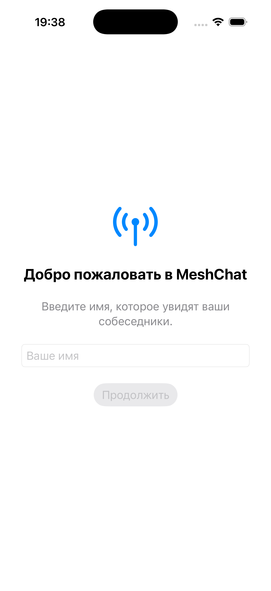
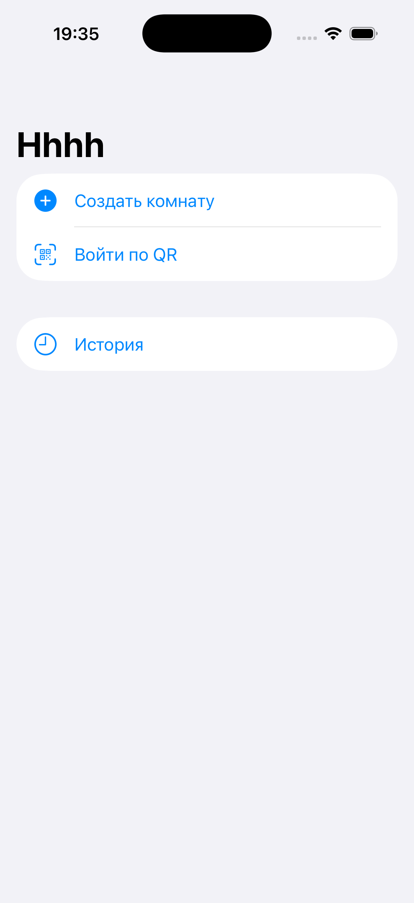
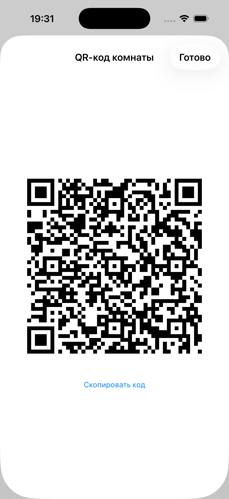
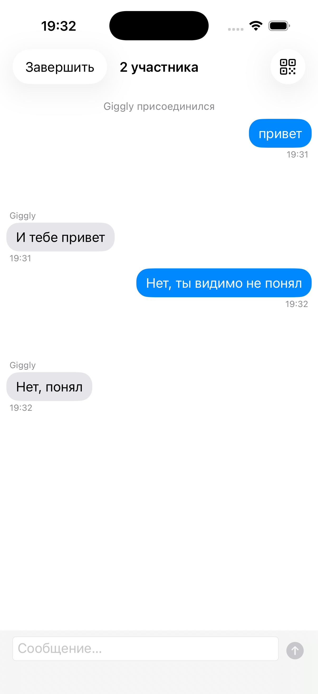
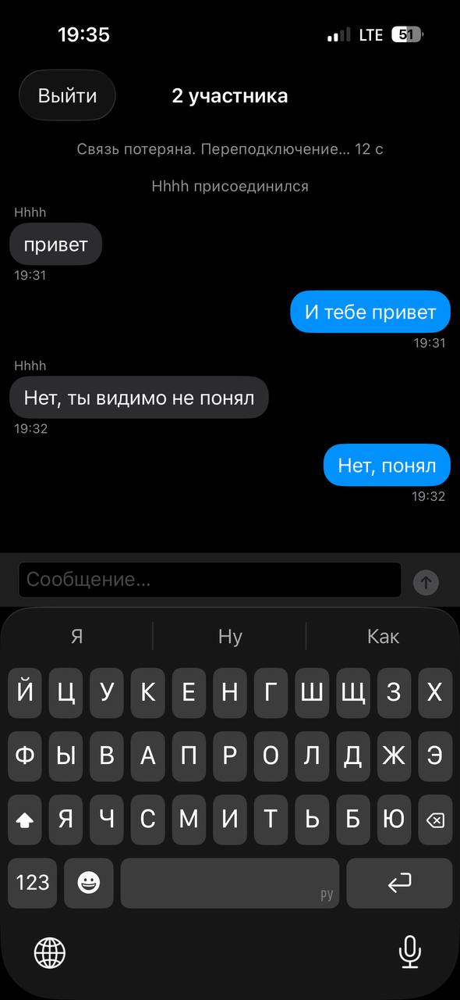
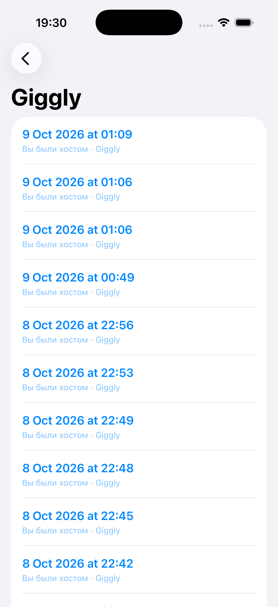
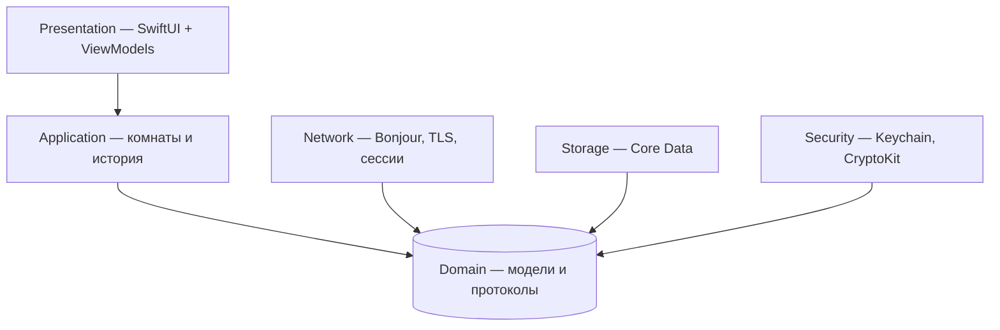
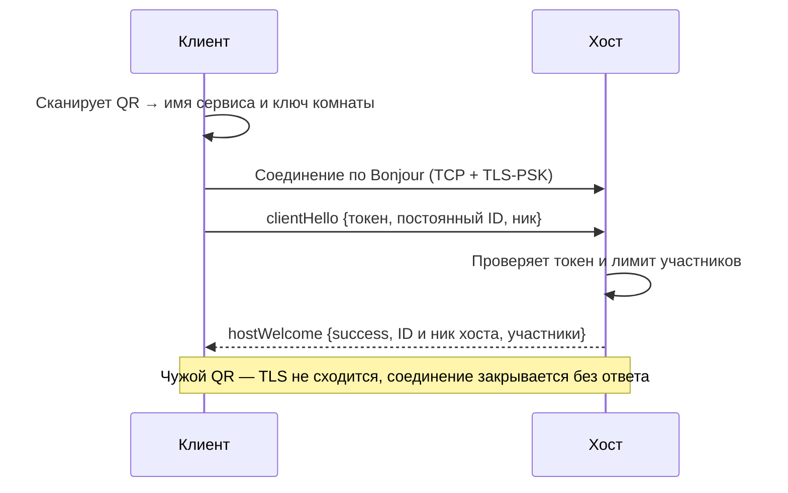

# MeshChat

**Офлайн-мессенджер для iPhone: групповой чат до 5 человек рядом — без интернета, серверов и аккаунтов.**

Один телефон создаёт комнату и показывает QR-код, остальные сканируют его и попадают в зашифрованный чат. Связь идёт напрямую между устройствами через Wi-Fi. Переписка сохраняется на устройстве: на вкладке «История» видны все чаты с каждым человеком — новые чаты с тем же собеседником добавляются к его истории автоматически.

> Курсовой проект · iOS 17+ · Swift 6 · SwiftUI · Core Data · Network.framework · лицензия GPL-3.0-or-later

## Скриншоты

| Онбординг | Главный экран | QR-код комнаты |
|---|---|---|
|  |  |  |

| Чат | Потеря связи | История |
|---|---|---|
|  |  |  |

## Возможности

- **Без интернета.** Связь через Wi-Fi напрямую между устройствами. iOS сама выбирает канал: общая Wi-Fi-сеть или peer-to-peer Wi-Fi без роутера.
- **Вход по QR.** Хост задаёт пароль, приложение превращает его в ключ комнаты и показывает QR. Клиент сканирует — и рукопожатие проходит автоматически, без ручного одобрения.
- **До 5 участников:** 1 хост и до 4 клиентов. Хост ретранслирует сообщения остальным.
- **Шифрование канала.** TLS с общим ключом из QR (TLS-PSK). Постоянный ID устройства и ник передаются только внутри зашифрованного канала.
- **Анонимность в эфире.** Имя Bonjour-сервиса — новый случайный UUID для каждой комнаты, поэтому комнаты нельзя связать между собой.
- **Устойчивость к обрывам.** Если связь пропала, есть 20 секунд на автоматическое переподключение. Переподключившийся участник не пропадает из чата, а если связь не вернулась — остальные видят «… отключился».
- **Постоянная история.** Чаты сохраняются в Core Data. Каждый новый чат с тем же человеком привязывается к его истории по постоянному ID. Прошлые переписки открываются на вкладке «История» (только чтение), в новый чат они не подгружаются.
- **Повторный вход.** Клиент, вылетевший по таймауту, возвращается в живую комнату кнопкой «Подключиться снова» и видит сообщения, написанные до обрыва.

## Как это устроено

Подробности — в [`ARCHITECTURE.md`](ARCHITECTURE.md). Это главный документ проекта: в нём все архитектурные решения (ADR), протоколы, формат пакетов, схема базы и журнал изменений.

### Слои



Слои общаются только через протоколы из Domain, а конкретные типы создаются в одном месте — `App/AppStartup.swift`. Поэтому сеть, хранилище и экраны тестируются отдельно, на подставных реализациях.

### Вход в комнату



### Безопасность

| Что | Как |
|---|---|
| Ключ комнаты | `HKDF-SHA256(пароль, случайная соль)`; пароль и ключ нигде не сохраняются |
| Канал | TLS-PSK: ключ выведен из ключа комнаты |
| Токен входа | `HMAC-SHA256(ключ комнаты, ID клиента)`, сравнение за постоянное время |
| Постоянный ID | UUID в Keychain (`AfterFirstUnlockThisDeviceOnly`), в открытый эфир не передаётся |

Известные ограничения и путь их развития описаны в [`ARCHITECTURE.md` §15](ARCHITECTURE.md#15-модель-угроз-и-известные-ограничения).

## Сборка и запуск

**Нужно:** Mac с Xcode 26 или новее, iPhone с iOS 17 или новее.

1. Склонировать репозиторий и открыть `MeshChat.xcodeproj`.
2. Signing & Capabilities → Team → свой Apple ID (подойдёт бесплатный).
3. Выбрать iPhone или симулятор → **Run** (⌘R).
4. На iPhone при первом запуске:
   - доверять разработчику: Настройки → Основные → VPN и управление устройством;
   - разрешить «Локальная сеть» и «Камера».

**Связь двух устройств.** На обоих должен быть включён Wi-Fi; подключаться к какой-либо сети не обязательно. Сканер QR в симуляторе не работает, поэтому в отладочной сборке есть кнопки «Скопировать код» и «Вставить код».

## Тестирование

- **277 автотестов** (Swift Testing): криптография и формат пакетов сверяются с заранее посчитанными контрольными значениями; сеть проверяется на подставных соединениях и на настоящем TLS через `127.0.0.1`; база проверяется в памяти.
- **Полная проверка проекта:**
  ```bash
  bash scripts/verify_meshchat.sh
  ```
  Скрипт проверяет настройки сборки, сборку без предупреждений, ключи Bonjour в `Info.plist`, контрольные значения и прогоняет все тесты.
- **Проверка на стабильность** — 10 прогонов подряд, все должны быть зелёными:
  ```bash
  bash scripts/stress_meshchat.sh
  ```
- **Ручные тесты на устройствах** — журнал с результатами: [`docs/MANUAL_TESTS.md`](docs/MANUAL_TESTS.md). Пройдено 19 из 23 сценариев; ещё 2 требуют дополнительных устройств.

## Структура проекта

```text
MeshChat/
├── App/            точка входа, сборка зависимостей
├── Domain/         модели, события, протоколы, ошибки
├── Security/       Keychain, ключ комнаты, токены
├── Network/        протокол, транспорт (Bonjour, TLS), сессии хоста и клиента
├── Storage/        модель Core Data и хранилище
├── Application/    комната, сервис комнат, история
└── Presentation/   экраны SwiftUI и ViewModel
MeshChatTests/      автотесты, подставные реализации
scripts/            скрипты проверки
docs/               журнал ручных тестов, скриншоты
```

## Процесс разработки

- Архитектура зафиксирована в `ARCHITECTURE.md` до начала кодирования; каждое изменение решений записано в журнал (§19).
- Проект разбит на этапы; каждый этап закрыт тегом (`v0.1` … `v1.0`).
- Коммиты оформлены по [Conventional Commits](https://www.conventionalcommits.org/): `feat`, `fix`, `test`, `docs`, `refactor`.
- Этап закрывается, когда все тесты зелёные 10 прогонов подряд.
- Ручные тесты на устройствах ловят то, чего не видят автотесты. Так на этапе 11 нашлась ошибка повторного входа: её разбор и решение — ADR-13 в `ARCHITECTURE.md`, а регрессионные тесты не дадут ей вернуться.
- Код написан с помощью ИИ-агента Claude Code по пошаговым заданиям и под проверкой автора: каждый этап проверен автотестами, скриптами и вручную на устройствах.

## Лицензия

[GNU GPL v3.0 или более поздняя версия](LICENSE). В каждом файле исходного кода — заголовок `SPDX-License-Identifier: GPL-3.0-or-later`.

## Автор

<Имя Фамилия>, <группа>, <университет>, 2026.
